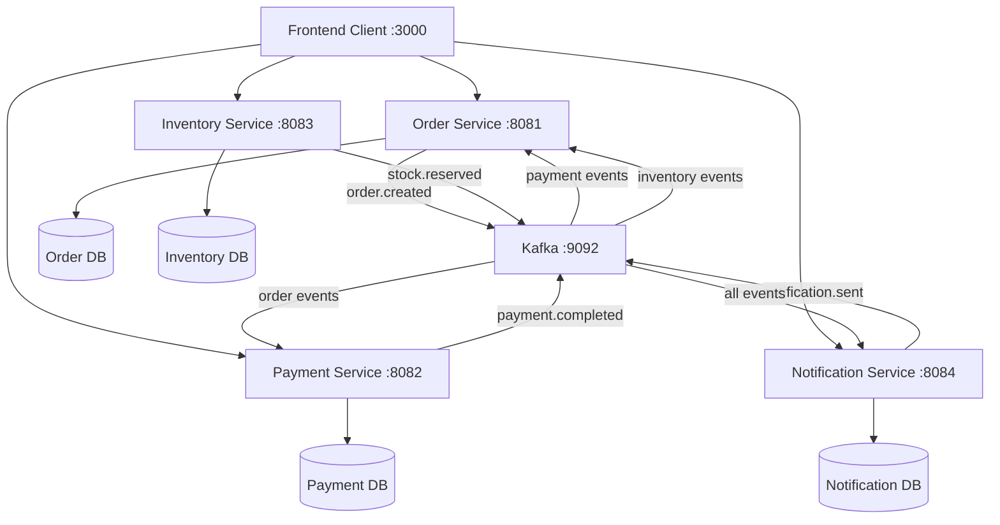

# Blue Zone E-commerce Microservices Workshop

## 🎯 Workshop Overview

Blue Zone is a **hands-on microservices workshop project** designed to teach distributed system architecture, event-driven design, and modern development practices. This project provides a **skeleton implementation** of an e-commerce platform that students will complete through guided assignments.

## 🏗️ Architecture Overview

### Current Implementation Status

| Service | Status | Port | Implementation Level |
|---------|--------|------|---------------------|
| **Order Service** | ✅ Partial | 8081 | ~70% - Basic CRUD + Kafka |
| **Payment Service** | ✅ Partial | 8082 | ~60% - Simulation + Events |
| **Inventory Service** | ❌ Skeleton | 8083 | ~5% - Shell only |
| **Notification Service** | ❌ Skeleton | 8084 | ~5% - Shell only |
| **Frontend Client** | ✅ Partial | 3000 | ~30% - Static UI components |
| **Kafka** | ✅ Working | 9092 | 100% - Message broker |
| **Zookeeper** | ✅ Working | 2181 | 100% - Kafka coordination |

### 🔄 Service Interaction Flow



## 📋 Quick Start

### Prerequisites
- Docker & Docker Compose
- Java 17+ (for local development)
- Node.js 18+ (for frontend development)
- Maven 3.8+ (for backend services)

### 🚀 Running the Complete System

```bash
# Clone the repository
git clone <repository-url>
cd blue-zone

# Build all services
docker compose build

# Start the complete system
docker compose up

# Or start infrastructure only
docker compose up kafka zookeeper

# Access the services
Frontend:     http://localhost:3000
Order API:    http://localhost:8081/api/orders
Payment API:  http://localhost:8082 (when implemented)
Inventory API: http://localhost:8083 (when implemented)
Notification API: http://localhost:8084 (when implemented)
```

### 🛠️ Development Mode

```bash
# Start just the infrastructure
docker compose up kafka zookeeper

# Run services locally for development
cd services/order-service && mvn spring-boot:run
cd services/payment-service && mvn spring-boot:run
# (Other services need implementation)

# Run frontend in development
cd frontend-client && npm run dev
```

## 📚 Workshop Structure

### 🎓 Learning Path

The workshop is designed as a **progressive learning experience** with increasing complexity:

1. **Foundation** (Weeks 1-2): Complete basic service implementations
2. **Integration** (Weeks 3-4): Implement service-to-service communication
3. **Advanced Features** (Weeks 5-6): Add security, monitoring, and optimization
4. **Production Ready** (Weeks 7-8): Add resilience, testing, and deployment

### 📁 Service-Specific Assignments

Each service has its own README with detailed assignments:

- [`services/order-service/README.md`](services/order-service/README.md) - 5 assignments (Beginner to Advanced)
- [`services/payment-service/README.md`](services/payment-service/README.md) - 6 assignments (Intermediate to Advanced)
- [`services/inventory-service/README.md`](services/inventory-service/README.md) - 6 assignments (Beginner to Advanced)
- [`services/notification-service/README.md`](services/notification-service/README.md) - 7 assignments (Beginner to Advanced)
- [`frontend-client/README.md`](frontend-client/README.md) - 8 assignments (Beginner to Advanced)

### 🏆 Difficulty Levels

- **🟢 Beginner**: Basic CRUD operations, simple API integration
- **🟡 Intermediate**: Service integration, event handling, business logic
- **🔴 Advanced**: Security, performance, complex workflows, external integrations

## 🎯 Learning Objectives

### 🏛️ Architectural Patterns
- **Microservices Architecture**: Service decomposition and boundaries
- **Event-Driven Architecture**: Asynchronous communication with Kafka
- **API-First Design**: RESTful service design and documentation
- **Database Per Service**: Data isolation and consistency patterns

### 🔧 Technical Skills
- **Backend Development**: Spring Boot, JPA, REST APIs
- **Frontend Development**: React, Next.js, TypeScript
- **Message Queues**: Apache Kafka for event streaming
- **Containerization**: Docker and Docker Compose
- **Testing**: Unit, integration, and end-to-end testing

### 🌐 Integration Patterns
- **Service Communication**: Synchronous and asynchronous patterns
- **Data Consistency**: Eventual consistency and compensation patterns
- **External Services**: Payment gateways, notification providers
- **API Gateway**: Centralized routing and cross-cutting concerns

### 🛡️ Production Concerns
- **Security**: Authentication, authorization, data protection
- **Monitoring**: Health checks, metrics, distributed tracing
- **Resilience**: Circuit breakers, retry logic, graceful degradation
- **Scalability**: Load balancing, horizontal scaling strategies

## 📈 Assignment Progression

### Phase 1: Foundation (Beginner)
```
Week 1-2: Complete basic service implementations
├── Order Service: Assignment 1 (Validation)
├── Inventory Service: Assignment 1-2 (Models + API)
├── Notification Service: Assignment 1-2 (Models + Email)
└── Frontend: Assignment 1 (API Integration)
```

### Phase 2: Integration (Intermediate)
```
Week 3-4: Implement service communication
├── Order Service: Assignment 2-4 (Inventory + Kafka + State Machine)
├── Payment Service: Assignment 1-3 (Gateway + Security + Methods)
├── Inventory Service: Assignment 3-4 (Stock Management + Kafka)
├── Notification Service: Assignment 3-4 (SMS + Event Handling)
└── Frontend: Assignment 2-4 (Real-time + Orders + Products)
```

### Phase 3: Advanced Features (Advanced)
```
Week 5-6: Add advanced functionality
├── Payment Service: Assignment 4-5 (Advanced Features + Analytics)
├── Inventory Service: Assignment 5-6 (Advanced + Reporting)
├── Notification Service: Assignment 5-7 (Push + Analytics)
└── Frontend: Assignment 5-7 (Payments + Notifications + Dashboard)
```

### Phase 4: Production Ready (Expert)
```
Week 7-8: Production readiness
├── All Services: Add comprehensive testing
├── Security: Authentication and authorization
├── Monitoring: Health checks and metrics
├── Deployment: CI/CD and production configuration
└── Frontend: Assignment 8 (Authentication + User Management)
```

## 🧪 Testing Strategy

### Testing Pyramid
```
E2E Tests (Frontend + All Services)
    ↑
Integration Tests (Service + Database + Kafka)
    ↑
Unit Tests (Business Logic + Controllers)
```

### Required Testing for Each Assignment
- **Unit Tests**: Service methods and business logic
- **Integration Tests**: API endpoints and database operations
- **Contract Tests**: Service-to-service communication
- **Performance Tests**: Load testing for critical paths

## 🛠️ Development Guidelines

### Code Quality Standards
- **Test Coverage**: Minimum 80% for each service
- **Code Review**: All assignments require peer review
- **Documentation**: API documentation with OpenAPI/Swagger
- **Linting**: Consistent code formatting and style

### Git Workflow
```bash
# Create feature branch for each assignment
git checkout -b feature/order-service-assignment-1

# Make commits with clear messages
git commit -m "feat(order): add order validation service"

# Push and create pull request
git push origin feature/order-service-assignment-1
```

## 🔍 Monitoring & Observability

### Health Checks
Each service should implement:
- **Liveness**: Is the service running?
- **Readiness**: Is the service ready to handle requests?
- **Dependencies**: Are external dependencies available?

### Metrics to Track
- **Business Metrics**: Orders created, payments processed, notifications sent
- **Technical Metrics**: Response times, error rates, throughput
- **Infrastructure Metrics**: CPU, memory, disk usage

## 🚀 Deployment Options

### Local Development
```bash
docker compose up  # Full stack locally
```

### Cloud Deployment (Advanced)
- **Kubernetes**: Container orchestration
- **AWS/GCP/Azure**: Cloud-native services
- **CI/CD**: Automated testing and deployment

## 📖 Additional Resources

### Recommended Reading
- **Microservices Patterns** by Chris Richardson
- **Building Event-Driven Microservices** by Adam Bellemare
- **Spring Boot in Action** by Craig Walls

### Documentation Links
- [Spring Boot Documentation](https://spring.io/projects/spring-boot)
- [Apache Kafka Documentation](https://kafka.apache.org/documentation/)
- [Next.js Documentation](https://nextjs.org/docs)
- [Docker Compose Documentation](https://docs.docker.com/compose/)

## 🤝 Contributing

### For Instructors
- Add new assignments by extending service READMEs
- Create additional complexity levels
- Add new services or external integrations

### For Students
- Follow the assignment progression
- Document your learning journey
- Share challenges and solutions with peers
- Contribute improvements back to the workshop

## 📞 Support

### Getting Help
1. **Service-specific issues**: Check the individual service README
2. **Integration problems**: Review the architecture diagram
3. **Setup issues**: Check Docker logs and port conflicts
4. **Assignment questions**: Refer to learning objectives and requirements

### Common Issues
- **Port conflicts**: Make sure ports 3000, 8081-8084, 9092, 2181 are available
- **Docker memory**: Ensure Docker has sufficient memory allocated (4GB+)
- **Kafka startup**: Wait for Kafka to be fully ready before starting services

---

## 🎉 Workshop Goals

By completing this workshop, students will have:

- ✅ Built a complete microservices architecture from scratch
- ✅ Implemented event-driven communication patterns
- ✅ Integrated with external services (payment gateways, notifications)
- ✅ Created a modern React frontend with real-time features
- ✅ Applied testing strategies for distributed systems
- ✅ Gained hands-on experience with production-ready patterns

**Welcome to the Blue Zone Microservices Workshop! Happy coding! 🚀**
